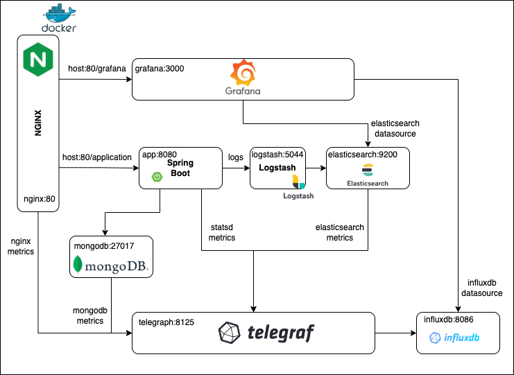

# Spring Boot Application Monitoring Using TIG Stack
Monitors Spring Boot Application using
- [Telegraph](https://www.influxdata.com/time-series-platform/telegraf/)
- [Influxdb](https://www.influxdata.com/)
- [Grafana](https://grafana.com/)

# Project structure
- app: backend application
- nginx: reverse proxy for the application
- grafana: dashboards for monitoring
- telegraph: agent for metrics collection
- gradle: build tool for the app
- logstash: agent for propagating logs from the app to elasticsearch
- docs: performance tests results
- [docker compose](./docker-compose.yml)
- [env variables](./configuration.env)
- [dockerfile for the app](./Dockerfile)

# Architecture


# Prerequisites
- java (17.0.4-oracle)
- [Docker](https://www.docker.com/)
- [Docker compose](https://docs.docker.com/compose/)
- [ab tool](https://httpd.apache.org/docs/2.4/programs/ab.html)

# Run
- build application ```./gradlew clean build```
- run ```docker-compose up --build -d```
- test POST endpoint 
```shell
curl --location 'http://localhost:80/application/api/v1/food' \
--header 'Content-Type: application/json' \
--data '{
    "id": "641aef1cb576805415aa210e",
    "name": {
        "ua": "Їжа",
        "eng": "Food"
    },
    "description": {
        "ua": "",
        "eng": ""
    },
    "imageUrl": "https://soul-menu-prod.s3.eu-central-1.amazonaws.com/food.png",
    "groups": [
        {
            "subId": "e64376c6-1adb-4b55-801d-f7ceff4e52c7",
            "category": "hot-dogs",
            "name": {
                "ua": "Хот-доги",
                "eng": "Hot-dogs"
            },
            "description": {
                "ua": "",
                "eng": ""
            },
            "imageUrl": "https://soul-menu-prod.s3.eu-central-1.amazonaws.com/img-hot-dog-01.png",
            "available": true,
            "items": [
                {
                    "subId": "360d3bd5-ff8e-4087-abe1-fbfaa940990a",
                    "name": {
                        "ua": "Козацький",
                        "eng": "Cosacs"
                    },
                    "description": {
                        "ua": "",
                        "eng": ""
                    },
                    "priceUnit": {
                        "ua": "UAH",
                        "eng": "грн"
                    },
                    "volumeUnit": {
                        "ua": "гр",
                        "eng": "g"
                    },
                    "prices": [
                        {
                            "description": {
                                "ua": "",
                                "eng": ""
                            },
                            "volume": 185,
                            "price": 50
                        }
                    ],
                    "available": true,
                    "imageUrl": "",
                    "ingredients": [
                        {
                            "subId": "343310ed-e4dd-4b7d-9acc-9089b028c263",
                            "name": {
                                "ua": "Запашна підкопчена сосиска",
                                "eng": ""
                            },
                            "description": {
                                "ua": "",
                                "eng": ""
                            },
                            "prices": [],
                            "volumeUnit": {
                                "ua": "",
                                "eng": ""
                            },
                            "available": true,
                            "imageUrl": ""
                        }
                    ]
                }
            ],
            "tags": [
                "hot-dogs"
            ]
        }
    ]
}'
```
- test GET endpoint: 
```shell 
- curl --location 'http://localhost:80/application/api/v1/food'
```
- run performance tests using [ab](https://httpd.apache.org/docs/2.4/programs/ab.html) tool:
```shell
ab -c 50 -n 50 -t 20 http://localhost:80/application/api/v1/food
```
```shell
ab -c 50 -n 100 -t 60 http://localhost:80/application/api/v1/food
```
- to stop the stack run: ```docker-compose down```

# Performance Tests

## No traffic


## Concurrency 50, threads 50, time 10 sec
```ab -c 50 -n 50 -t 20 http://localhost:80/application/api/v1/food```


## Concurrency 50, threads 100, time 60 sec
```ab -c 50 -n 100 -t 60 http://localhost:80/application/api/v1/food```


## Comparing diagrams in 30 min window between no traffic, low load, high load


